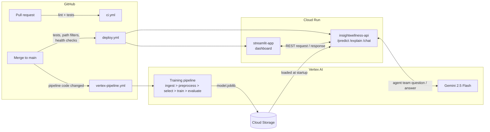

# InsightWellness AI

InsightWellness AI is a project developed for the INFO9023 Machine Learning Systems Design course at ULiège, designed to put MLOps concepts into practice. It combines a `HistGradientBoostingClassifier` model that predicts a user's obesity level from lifestyle data, a Streamlit dashboard for interactive use, and a multi-agent assistant that lets users ask follow-up questions about their predictions.

## Architecture



## Project Structure

```
InsightWellness-AI/
├── insightwellness_ai/                 # Main package
│   ├── config.py                       # Single config source (env-driven: GCP_PROJECT_ID, GCP_REGION, GCS_BUCKET)
│   ├── api/                            # Flask API (Cloud Run service: insightwellness-api)
│   │   ├── app.py                      # App assembly: Swagger + blueprint registration
│   │   ├── schema.py                   # Expected input schema + class mapping
│   │   ├── model_store.py              # Model/explainer loading from GCS
│   │   ├── validation.py               # Payload validation
│   │   └── routes_{info,prediction,chat}.py  # Endpoints as Flask blueprints
│   ├── agents/                         # Multi-agent assistant behind POST /chat
│   ├── pipeline/                       # Shared ML logic (preprocess, model selection, training, evaluation)
│   └── dashboard/                      # Streamlit app (Cloud Run service: streamlit-app)
├── vertex/                             # Thin KFP component wrappers importing insightwellness_ai/pipeline
├── data/                               # Knowledge base (markdown) indexed by the RAG agent
├── notebooks/                          # EDA and model experimentation
├── docs/                               # Dataset card and experimentation notes
├── tests/                              # 31 offline tests (~1s), incl. pipeline<->API schema contract test
├── .github/workflows/                  # ci.yml, deploy.yml, vertex-pipeline.yml + reusable tests.yml, deploy-cloud-run.yml
├── Dockerfile                          # API image
├── Dockerfile.streamlit                # Dashboard image
├── Dockerfile.vertex                   # Pipeline base image (bakes in insightwellness_ai/)
├── params.yaml
└── pyproject.toml
```

## Model

The production model is a `HistGradientBoostingClassifier` (scikit-learn), trained and tuned by the Vertex AI pipeline (shared logic in `insightwellness_ai/pipeline/`, KFP wrappers in `vertex/`) and stored in GCS as `model.joblib`. The API loads it at startup and serves predictions with SHAP-based explanations.

## API

The REST API is built with **Flask** (blueprints) and served via **Gunicorn** on **Google Cloud Run**. On startup it downloads the latest trained model (`model.joblib`) from Cloud Storage using `gcsfs`.

### Endpoints

- **`GET /`** : General information about the API and available routes.
- **`GET /status`** : Health check — API running and model loaded.
- **`GET /features`** : Expected JSON schema with descriptions and valid values for all 17 lifestyle features.
- **`POST /predict`** : Main inference endpoint. Validates the payload against the schema and returns the predicted obesity class.
- **`POST /explain`** : Same payload as `/predict`; returns the prediction plus class probabilities and the top SHAP feature impacts driving it (`?top_n=` to control how many).
- **`POST /chat`** : Ask the multi-agent assistant a question (`{"question": "..."}`) about a prediction, the dataset, or healthy habits.
- **`GET /apidocs`** : Interactive Swagger documentation.

## Multi-agent assistant (`POST /chat`)

The assistant turns model outputs into answers a user can act on. It runs inside the main API service (no separate backend) and is built with **Agno** on **Gemini 2.5 Flash** via Vertex AI. A coordinator orchestrates four specialised agents, each with one job:

| Agent | Role |
|---|---|
| **Obesity Predictor** | Calls the API's own `/predict` with the user's lifestyle data and returns the predicted class — nothing else. |
| **Explainability Expert** | Calls `/explain` and reports the SHAP feature impacts verbatim, so explanations come from the model, not the LLM's imagination. |
| **Health Knowledge Expert** | Answers grounded questions via RAG over the project knowledge base (`data/*.md`: dataset card, BMI classes, feature semantics, model limitations), citing its sources. |
| **Web Researcher** | Fetches external context (via DuckDuckGo) only when the dataset and knowledge base cannot answer. |

The coordinator enforces the flow: predict first, explain when asked why, ground every health statement in the knowledge base, flag anything beyond it as general information, and always append a "not medical advice" disclaimer. The Streamlit dashboard's *Ask the team* page is a thin client for this endpoint.

## Dashboard

The Streamlit app (`insightwellness_ai/dashboard/`) has three pages: **Prediction** (form for the 17 features, calls `/predict` + `/explain`, plots class probabilities and SHAP drivers), **Data exploration** (feature distributions with the user's values overlaid), and **Ask the team** (chat with the agent team via `/chat`).

## Vertex AI pipeline

- **Data ingestion**: collect data from BigQuery.
- **Preprocess**: cleaning, encoding, train/test split (`insightwellness_ai/pipeline/preprocess.py`).
- **Model selection**: hyperparameter tuning (GridSearchCV).
- **Training**: fit the final model and upload `model.joblib` to GCS.
- **Evaluation**: performance metrics on the test split.
```
