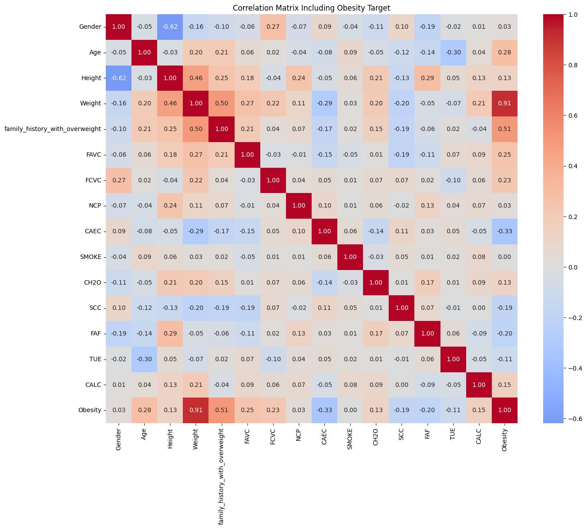
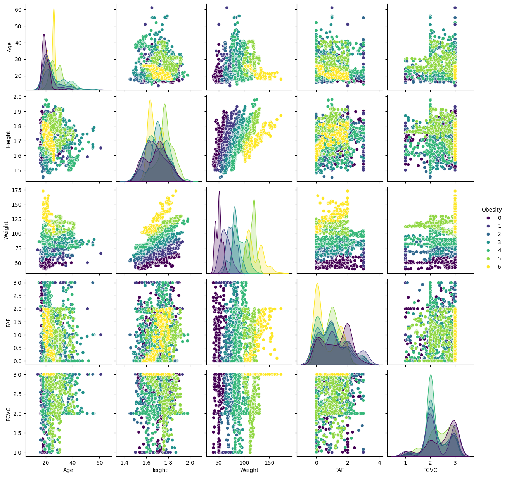

# Exploratory_data_analysis_documentation

## 1. Dataset Background

This dataset was created to support the automated estimation of obesity levels based on individuals eating habits and physical condition. Data was collected from individuals in Mexico, Peru, and Colombia via a web survey. To expand the dataset, **77% of the records were synthetically generated using the SMOTE (Synthetic Minority Oversampling Technique)** algorithm. Only 23% are original survey responses.

| Property | Value |
|---|---|
| Total records | 2,111 |
| Features | 16 (+ 1 target) |
| Task type | Multi-class classification |
| Classes | 7 |
| Missing values | 0 |
| Duplicate rows | 24 |
| Synthetic portion | ~77% (SMOTE) |
| Countries | Mexico, Peru, Colombia |

---

## 2. Variable Description

| Variable Name | Role | Type | Demographic | Description | Units | Missing Values |
|---------------|------|------|-------------|-------------|-------|----------------|
| Gender | Feature | Categorical | Gender |  |  | No |
| Age | Feature | Continuous | Age |  |  | No |
| Height | Feature | Continuous |  |  |  | No |
| Weight | Feature | Continuous |  |  |  | No |
| family_history_with_overweight | Feature | Binary |  | Has a family member suffered or suffers from overweight? |  | No |
| FAVC | Feature | Binary |  | Do you eat high caloric food frequently? |  | No |
| FCVC | Feature | Integer |  | Do you usually eat vegetables in your meals? |  | No |
| NCP | Feature | Continuous |  | How many main meals do you have daily? |  | No |
| CAEC | Feature | Categorical |  | Do you eat any food between meals? |  | No |
| SMOKE | Feature | Binary |  | Do you smoke? |  | No |
| CH2O | Feature | Continuous |  | How much water do you drink daily? |  | No |
| SCC | Feature | Binary |  | Do you monitor the calories you eat daily? |  | No |
| FAF | Feature | Continuous |  | How often do you have physical activity? |  | No |
| TUE | Feature | Integer |  | How much time do you use technological devices? |  | No |
| CALC | Feature | Categorical |  | How often do you drink alcohol? |  | No |
| MTRANS | Feature | Categorical |  | Which transportation do you usually use? |  | No |
| NObeyesdad | Target | Categorical |  | Obesity level |  | No |

---

## 3. Data Quality

### Missing Values

No missing values were detected across any column

### Duplicate Records

24 duplicate rows were detected (1.14%).

### Numeric Sanity Check

All numerical values fall within plausible ranges. No negative values.

## 4. Target Variable

### Class Labels

The target variable `NObeyesdad` contains 7 classes.

```
Insufficient_Weight    272
Normal_Weight          287
Overweight_Level_I     290
Overweight_Level_II    290
Obesity_Type_I         351
Obesity_Type_II        297
Obesity_Type_III       324
```

### Class Balance

The dataset is approximately balanced across the 7 classes.


## 5. Correlation




## 6. Pairplot



## 7. Limitations

- Data is self-reported.
- 77% of the records were synthetically generated.
- Limited geographically
- Models trained on this dataset may oversimplify complex health conditions.
